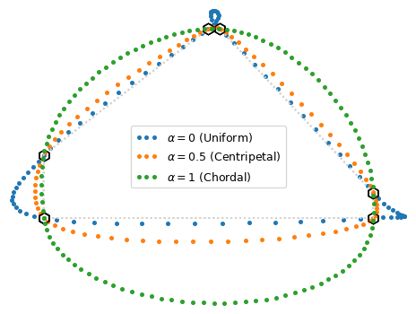

# Examples

Although, CatSmoothing doesn't have any dependencies, the example notebooks have several
dependencies. You can install all the dependencies using `micromamba`
(or `conda` or `mamba`):

```bash
micormamba create -n catsmoothing ipykernel ipywidgets matplotlib-base
```

This will create a new environment called `smoothing` with all the required packages.
You can also download [this](https://raw.githubusercontent.com/cheginit/catsmoothing/main/environment.yml) `environment.yml` and create the environment using:

```bash
micromamba env create -f environment.yml
```

Alternatively, you can install the dependencies using `pip`:

```bash
python -m venv ./venv
source ./venv/bin/activate
pip install catsmoothing ipykernel ipywidgets matplotlib
```

<div class="grid cards" markdown>

- [{ loading=lazy }](splines.ipynb "Basin Delineation")
    **Basin Delineation**

</div>
